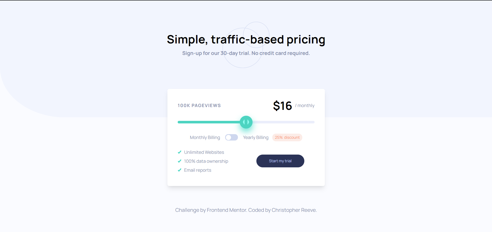

# Frontend Mentor - Interactive pricing component solution

This is a solution to the [Interactive pricing component challenge on Frontend Mentor](https://www.frontendmentor.io/challenges/interactive-pricing-component-t0m8PIyY8). Frontend Mentor challenges help you improve your coding skills by building realistic projects. 

## Table of contents
1. [Frontend Mentor - Interactive pricing component solution](#frontend-mentor---interactive-pricing-component-solution)
	1. [Table of contents](#table-of-contents)
		1. [The challenge](#the-challenge)
		2. [Screenshot](#screenshot)
		3. [Links](#links)
		4. [Built with](#built-with)
		5. [What I learned](#what-i-learned)
	2. [Author](#author)

### The challenge

Users should be able to:

- View the optimal layout for the app depending on their device's screen size
- See hover states for all interactive elements on the page
- Use the slider and toggle to see prices for different page view numbers

### Screenshot

### Links

- Solution URL: [Frontend Mentor](https://www.frontendmentor.io/solutions/interactive-pricing-component-with-vuejs-yKaGy2Bkn)
- Live Site: [Live Site](https://interactive-pricing-component-one-black.vercel.app/)

### Built with

- [Vite js](https://vitejs.dev/) - Front-end build tool
- [Vue 3](https://v3.vuejs.org/) - JS library
- [Typescript](https://www.typescriptlang.org/)
- [Tailwindcss](https://tailwindcss.com/) - For styles

### What I learned

I finally learn using css module and styling an input range. i really kind of having a hard time figuring the custom input range.

## Author

- Website -[creeve.me](https://creeve.me)
- Frontend Mentor - [@zynth17](https://www.frontendmentor.io/profile/zynth17)
- Twitter - [@hi_reeve](https://twitter.com/hi_reeve)
- Instagram - [@hi_reeve](https://www.instagram.com/hi_reeve/)
- Github - [zynth17](https://github.com/zynth17)
